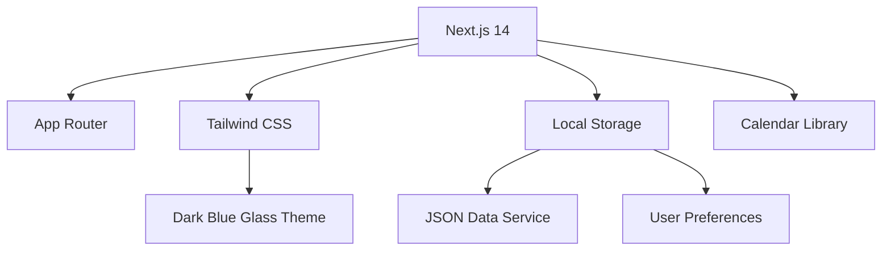

# RoamAtlas Development Roadmap

A phased approach to building a unified travel workspace with a **dark blue glassmorphism** theme.

---

## Design System: Dark Blue Glass Theme

| Token | Value | Usage |
|-------|-------|-------|
| `--bg-primary` | `#0a1628` | Page background |
| `--bg-glass` | `rgba(15, 30, 60, 0.7)` | Card/panel backgrounds |
| `--bg-glass-hover` | `rgba(25, 45, 80, 0.8)` | Hover states |
| `--border-glass` | `rgba(100, 150, 255, 0.15)` | Subtle borders |
| `--text-primary` | `#f0f4ff` | Headings, primary text |
| `--text-secondary` | `#8ba3c7` | Secondary/muted text |
| `--accent-blue` | `#3b82f6` | Primary actions, links |
| `--accent-cyan` | `#22d3ee` | Highlights, badges |
| `--shadow-glass` | `0 8px 32px rgba(0,0,0,0.4)` | Elevated elements |
| `--blur` | `backdrop-filter: blur(12px)` | Glass effect |

> [!TIP]
> All components use `backdrop-filter: blur()` with semi-transparent backgrounds to achieve the glass effect.

---

## Phase 1: Foundation (Weeks 1–2)

**Goal**: Project setup, authentication, and core layout with dark blue glass theme.

### Milestone 1.1: Project Setup ✅
- [x] Initialize Next.js 14 with App Router
- [x] Configure Tailwind CSS with custom dark blue glass theme
- [x] Create local JSON data service (localStorage + JSON files)
- [x] Create base layout components (Sidebar, MainPanel)
- [x] Implement responsive glass-themed shell

### Milestone 1.2: Basic Auth (Mocked) ✅
- [x] Simple user context (guest mode / local user)
- [x] Sign in / Sign up UI with glass modals (local storage only)
- [x] Protected route structure (prep for future Firebase)
- [x] User preferences stored locally

### Deliverables
- Working app shell with local data persistence
- Dark blue glass sidebar + header
- `/login`, `/signup` routes (local mode)

---

## Phase 2: Trip Management (Weeks 3–4) ✅

**Goal**: CRUD operations for trips with list and overview views.

### Milestone 2.1: Trip CRUD ✅
- [x] Trip data model in local JSON (`trips` array)
- [x] Create trip modal/form with glass styling
- [x] Edit and archive trip functionality
- [x] "Current trip" selection and persistence in localStorage

### Milestone 2.2: Trip Views ✅
- [x] `/trips` — All trips list with glass cards
- [x] `/trips/[tripId]` — Trip overview page
- [x] Sidebar navigation updates for current trip sections
- [x] Trip summary cards (destination, dates, status)

### Deliverables
- Full trip CRUD
- Glass-styled trip cards and forms
- Dynamic sidebar based on selected trip

---

## Phase 3: Booking Management (Weeks 5–7) ✅

**Goal**: Add/edit/view flights, accommodations, cars, trains, and excursions.

### Milestone 3.1: Flights ✅
- [x] `flights` array nested in trip JSON
- [x] Flight form (airline, flight#, origin/dest, times, cost)
- [x] Flights list view with glass cards
- [x] Flight detail/edit modal

### Milestone 3.2: Accommodations ✅
- [x] `accommodations` array nested in trip JSON
- [x] Accommodation form (property, address, check-in/out, cost)
- [x] Accommodations list with stay duration display

### Milestone 3.3: Ground Transport
- [x] `cars` placeholder page (coming soon)
- [x] `trains` placeholder page (coming soon)
- [ ] Full CRUD (deferred)

### Milestone 3.4: Excursions ✅
- [x] `excursions` array in trip JSON
- [x] Excursion form with categories (tour, museum, reservation, etc.)
- [x] Excursions list with category filtering

### Deliverables
- All booking types CRUD complete
- Consistent glass-themed forms and lists
- Routes: `/trips/[tripId]/flights`, `/accommodations`, `/cars`, `/trains`, `/excursions`

---

## Phase 4: Calendar Integration (Weeks 8–9) ✅

**Goal**: Visual calendar aggregating all trip activities.

### Milestone 4.1: Calendar Component ✅
- [x] Custom TripCalendar component with month view
- [x] Dark blue glass calendar styling
- [x] Month navigation (prev/next)
- [x] Trip date range highlighting

### Milestone 4.2: Event Integration ✅
- [x] Derive calendar events from all booking types
- [x] Color coding by type:
  - Flights: `#3b82f6` (blue)
  - Accommodations: `#22c55e` (green)
  - Transport: `#f97316` (orange)
  - Excursions: `#a855f7` (purple)
- [x] Click day to open DayModal with all events
- [x] Event type legend

### Milestone 4.3: Day Overview Modal ✅
- [x] Clickable days open detailed modal
- [x] Events grouped by type
- [x] Full event details (times, costs, confirmations)
- [x] Trip range indicator

### Deliverables
- Fully functional calendar on `/trips/[tripId]/calendar`
- Glass-styled DayModal with event details
- Sidebar calendar navigation link

---

## Phase 5: Expense Tracking (Week 10)

**Goal**: Record and summarize trip expenses.

### Milestone 5.1: Expenses CRUD ✅
- [x] `expenses` array in trip JSON
- [x] Expense form (date, description, category, amount, currency)
- [x] Link expenses to bookings (optional)

### Milestone 5.2: Expense Views ✅
- [x] Expenses list with filters
- [x] Category breakdown summary cards
- [x] Total trip cost display on overview
- [x] Optional expense markers on calendar

### Deliverables
- Complete expense tracking
- Glass-styled expense cards and summaries
- Route: `/trips/[tripId]/expenses`

---

## Phase 6: Itinerary Builder (Week 11) ✅

**Goal**: Create a detailed, day-by-day itinerary view with drag-and-drop reordering.

### Milestone 6.1: Itinerary Logic ✅
- [x] Group all bookings by date
- [x] Handle time zone adjustments
- [x] Specific "Day View" component

### Milestone 6.2: Drag and Drop ✅
- [x] Implement dnd-kit or react-beautiful-dnd
- [x] Allow reordering of activities within a day
- [x] Allow moving activities between days

### Deliverables
- Interactive Itinerary Page on `/trips/[tripId]/itinerary`

---

## Phase 7: Polish & Launch (Week 12)

**Goal**: Refinement, testing, and deployment.

### Milestone 6.1: UI Polish
- [ ] Micro-animations (hover, transitions)
- [ ] Loading skeletons with glass effect
- [ ] Empty states and error handling
- [ ] Accessibility review (contrast, keyboard nav)

### Milestone 6.2: Testing
- [ ] Unit tests for utility functions
- [ ] Integration tests for data service operations
- [ ] E2E tests for critical flows (trip CRUD, bookings)
- [ ] Cross-browser and responsive testing

### Milestone 6.3: Deployment
- [ ] Vercel deployment setup
- [ ] Performance optimization (code splitting, caching)
- [ ] Documentation and README
- [ ] Export/import JSON data functionality

### Deliverables
- Production-ready application
- Smooth, polished user experience
- Live deployment

---

## Phase 7: Firebase Integration (Post-MVP)

**Goal**: Migrate from local storage to Firebase for cloud sync and multi-device access.

- [ ] Set up Firebase project (Auth + Firestore)
- [ ] Firebase Auth (email/password + Google OAuth)
- [ ] Migrate data models to Firestore collections
- [ ] Sync service with offline support
- [ ] Data migration tool (local JSON → Firestore)

---

## Future Enhancements (Post-Firebase)

| Feature | Description |
|---------|-------------|
| **Collaborative Trips** | Multi-user access with roles |
| **Offline Support** | PWA with service workers |
| **Drag-and-Drop Calendar** | Adjust event times visually |
| **Email Parsing** | Import bookings from confirmation emails |
| **AI Suggestions** | Itinerary recommendations |
| **Mobile App** | React Native companion app |
| **Print/Export** | PDF itinerary export |

---

## Tech Stack Summary

---

## Timeline Overview

| Phase | Duration | Focus |
|-------|----------|-------|
| Phase 1 | Weeks 1–2 | Foundation + Auth |
| Phase 2 | Weeks 3–4 | Trip Management |
| Phase 3 | Weeks 5–7 | Bookings (5 types) |
| Phase 4 | Weeks 8–9 | Calendar |
| Phase 5 | Week 10 | Expenses |
| Phase 6 | Week 11 | Itinerary Builder |
| Phase 7 | Week 12 | Polish + Launch |

**Total estimated time: ~12 weeks for MVP**
